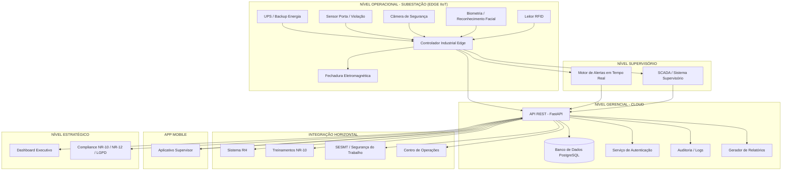

```mermaid
flowchart TB

%% =========================
%% NÍVEL 1 - CAMPO (EDGE)
%% =========================
subgraph CAMPO["NÍVEL OPERACIONAL - SUBESTAÇÃO (EDGE IIoT)"]
    RFID[Leitor RFID]
    BIO[Biometria / Reconhecimento Facial]
    CAM[Câmera de Segurança]
    SENS[Sensor Porta / Violação]
    CTRL[Controlador Industrial Edge]
    LOCK[Fechadura Eletromagnética]
    UPS[UPS / Backup Energia]

    RFID --> CTRL
    BIO --> CTRL
    CAM --> CTRL
    SENS --> CTRL
    CTRL --> LOCK
    UPS --> CTRL
end

%% =========================
%% NÍVEL 2 - SUPERVISÓRIO
%% =========================
subgraph SUPERVISORIO["NÍVEL SUPERVISÓRIO"]
    SCADA[SCADA / Sistema Supervisório]
    ALERT[Motor de Alertas em Tempo Real]
end

CTRL --> SCADA
CTRL --> ALERT

%% =========================
%% NÍVEL 3 - GESTÃO (NUVEM)
%% =========================
subgraph NUVEM["NÍVEL GERENCIAL - CLOUD"]
    API[API REST - FastAPI]
    DB[(Banco de Dados PostgreSQL)]
    AUTH[Serviço de Autenticação]
    AUDIT[Auditoria / Logs]
    REPORT[Gerador de Relatórios]
end

SCADA --> API
ALERT --> API
CTRL --> API

API --> DB
API --> AUTH
API --> AUDIT
API --> REPORT

%% =========================
%% INTEGRAÇÃO HORIZONTAL
%% =========================
subgraph HORIZONTAL["INTEGRAÇÃO HORIZONTAL"]
    RH[Sistema RH]
    TREIN[Treinamentos NR-10]
    SESMT[SESMT / Segurança do Trabalho]
    CCO[Centro de Operações]
end

API --> RH
API --> TREIN
API --> SESMT
API --> CCO

%% =========================
%% MOBILE
%% =========================
subgraph MOBILE["APP MOBILE"]
    APP[Aplicativo Supervisor]
end

APP --> API
API --> APP

%% =========================
%% ESTRATÉGICO
%% =========================
subgraph ESTRATEGICO["NÍVEL ESTRATÉGICO"]
    KPI[Dashboard Executivo]
    COMPLIANCE[Compliance NR-10 / NR-12 / LGPD]
end

API --> KPI
API --> COMPLIANCE
```