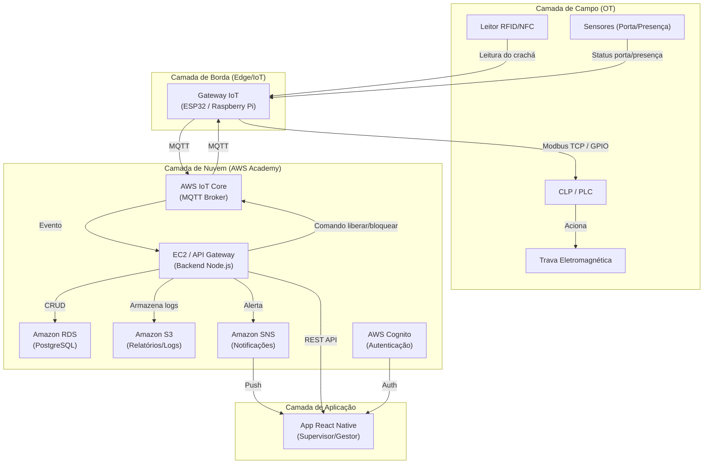
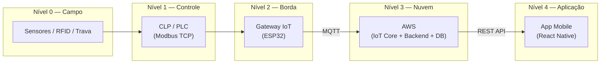
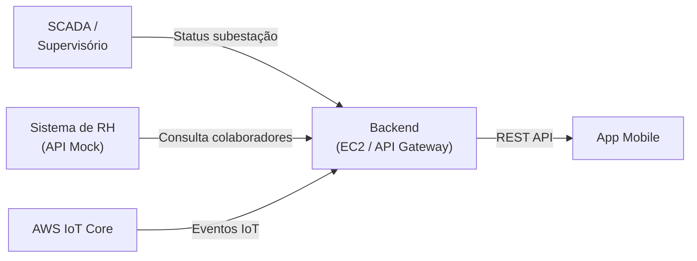
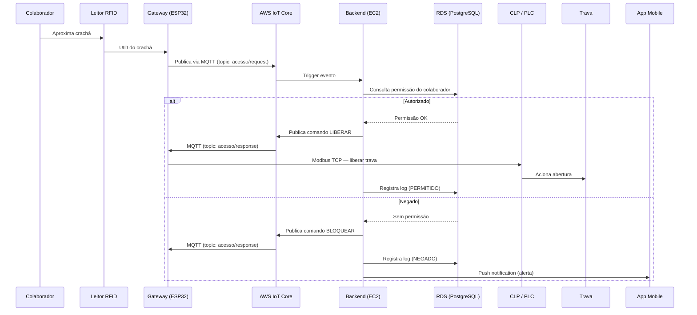
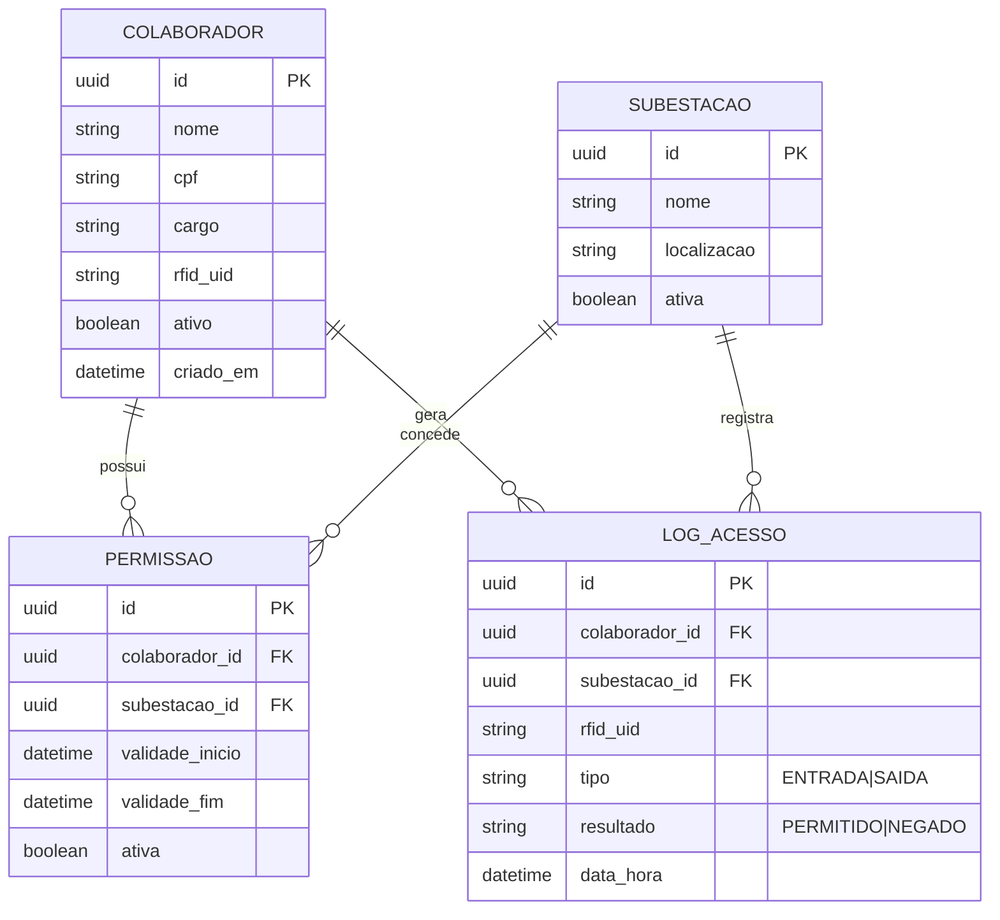

# Arquitetura — Sistema de Controle de Acesso de Subestação

> Documento complementar ao [PRD](./PRD.md)

---

## 1. Visão Geral das Camadas

O sistema é dividido em **4 camadas**, seguindo o modelo de integração vertical (do chão de fábrica à aplicação):

| Camada | Descrição | Tecnologias |
|---|---|---|
| **Campo (OT)** | Dispositivos físicos na subestação | Leitor RFID, sensores, CLP, trava eletromagnética |
| **Borda (Edge/IoT)** | Gateway que conecta campo à nuvem | ESP32 / Raspberry Pi |
| **Nuvem (AWS)** | Backend, banco de dados, broker MQTT | EC2, RDS, IoT Core, S3, SNS, CloudWatch |
| **Aplicação** | Interface do usuário final | React Native (Expo) |

---

## 2. Diagrama de Arquitetura

---

## 3. Diagrama de Integração Vertical

---

## 4. Diagrama de Integração Horizontal

---

## 5. Fluxo Principal — Acesso à Subestação

---

## 6. Detalhamento por Camada

### 6.1 Camada de Campo (OT)

| Componente | Função | Protocolo |
|---|---|---|
| Leitor RFID MFRC522 | Lê UID do crachá NFC/RFID | SPI (com ESP32) |
| Sensor de porta | Detecta porta aberta/fechada | GPIO digital |
| Sensor de presença | Detecta pessoa na área | GPIO digital |
| CLP / PLC | Controla trava eletromagnética | Modbus TCP |
| Trava eletromagnética | Libera/bloqueia acesso físico | Acionada via CLP |

### 6.2 Camada de Borda (Gateway IoT)

| Aspecto | Detalhe |
|---|---|
| **Hardware** | ESP32 (ou Raspberry Pi) |
| **Firmware** | MicroPython ou Arduino (C++) |
| **Comunicação nuvem** | MQTT com TLS (AWS IoT Core) |
| **Comunicação campo** | SPI (RFID), GPIO (sensores), Modbus TCP (CLP) |
| **Modo offline** | Fila local de eventos, sincroniza ao reconectar |
| **Cache** | Tabela local de permissões para validação offline |

### 6.3 Camada de Nuvem (AWS Academy)

| Serviço AWS | Função | Custo |
|---|---|---|
| **IoT Core** | Broker MQTT para comunicação com gateways | AWS Academy |
| **EC2** | Servidor backend (Node.js + Express) | AWS Academy |
| **API Gateway** | Exposição de APIs REST para o app mobile | AWS Academy |
| **RDS (PostgreSQL)** | Banco relacional (colaboradores, permissões, logs) | AWS Academy |
| **S3** | Armazenamento de relatórios e logs de longo prazo | AWS Academy |
| **SNS** | Envio de notificações push | AWS Academy |
| **Cognito** | Autenticação e autorização de usuários do app | AWS Academy |
| **CloudWatch** | Monitoramento e alertas de infraestrutura | AWS Academy |

### 6.4 Camada de Aplicação (Mobile)

| Aspecto | Detalhe |
|---|---|
| **Framework** | React Native (Expo) |
| **Plataformas** | Android e iOS |
| **Autenticação** | AWS Cognito (login/signup) |
| **Comunicação** | REST API (backend EC2) |
| **Notificações** | Push via SNS + FCM |
| **Telas principais** | Login, Dashboard, Histórico, Gerenciamento, Relatórios |

---

## 7. Modelo de Dados (Simplificado)

---

## 8. Tópicos MQTT

| Tópico | Direção | Payload (exemplo) |
|---|---|---|
| `subestacao/{id}/acesso/request` | Gateway → Nuvem | `{"rfid_uid": "A1B2C3D4", "timestamp": "..."}` |
| `subestacao/{id}/acesso/response` | Nuvem → Gateway | `{"acao": "LIBERAR", "colaborador": "João"}` |
| `subestacao/{id}/sensor/porta` | Gateway → Nuvem | `{"status": "ABERTA", "timestamp": "..."}` |
| `subestacao/{id}/sensor/presenca` | Gateway → Nuvem | `{"detectado": true, "timestamp": "..."}` |
| `subestacao/{id}/status` | Gateway → Nuvem | `{"online": true, "ultima_sync": "..."}` |

---

## 9. Endpoints da API REST

| Método | Rota | Descrição |
|---|---|---|
| `POST` | `/auth/login` | Login (via Cognito) |
| `GET` | `/colaboradores` | Lista colaboradores |
| `POST` | `/colaboradores` | Cadastra colaborador |
| `PUT` | `/colaboradores/:id` | Atualiza colaborador |
| `DELETE` | `/colaboradores/:id` | Remove colaborador |
| `GET` | `/permissoes` | Lista permissões |
| `POST` | `/permissoes` | Concede permissão |
| `DELETE` | `/permissoes/:id` | Revoga permissão |
| `GET` | `/logs` | Lista logs de acesso (com filtros) |
| `GET` | `/relatorios` | Gera relatório por período |
| `GET` | `/subestacoes` | Lista subestações |
| `GET` | `/subestacoes/:id/status` | Status ao vivo da subestação |