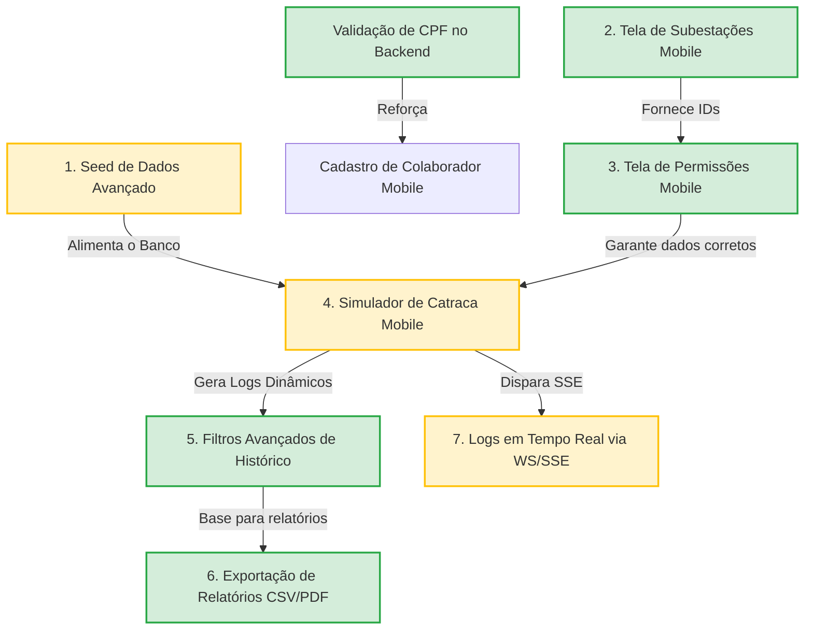

# Mapa de Implementação de Software

Este documento mapeia o estado atual do desenvolvimento do software do **Sistema de Controle de Acesso de Subestação**, definindo o que já está pronto, o que falta construir, os graus de prioridade e a árvore de dependências para orientar as próximas sprints.

---

## 📊 Matriz de Estado do Sistema

Abaixo está o panorama de tudo o que foi planejado no [PRD](./PRD.md) e o que está codificado:

| Módulo | Funcionalidade / Recurso | Status | Nível | Tipo |
| :--- | :--- | :--- | :--- | :--- |
| **API** | Modelos e Migrações do Banco (PostgreSQL/SQLAlchemy) | **Concluído** | Core | Backend |
| **API** | Autenticação Segura via JWT e Passwords Hashed | **Concluído** | Core | Backend |
| **API** | CRUD de Colaboradores com Foto de Perfil | **Concluído** | Core | Backend |
| **API** | CRUD de Subestações | **Concluído** | Core | Backend |
| **API** | Concessão e Revogação de Permissões | **Concluído** | Core | Backend |
| **API** | Validador de RFID e Regras de Negócio (`/acesso/validar`) | **Concluído** | Core | Backend |
| **API** | Logs de Acessos com Filtros por Cargo | **Concluído** | Core | Backend |
| **API** | Validação Matemática de CPFs Brasileiros | **Concluído** | Médio | Backend |
| **API** | Logs de Auditoria Administrativa | **Pendente** | Baixo | Backend |
| **API** | Endpoint de Exportação de Logs para Excel/PDF | **Concluído** | Médio | Backend |
| **API** | Seed Avançado de Dados Fictícios | **Pendente** | Alto | Backend |
| **Mobile** | Contexto de Autenticação (`AuthContext`) | **Concluído** | Core | Frontend |
| **Mobile** | Tela de Login | **Concluído** | Core | Frontend |
| **Mobile** | Dashboard com Gráficos e Indicadores Básicos | **Concluído** | Core | Frontend |
| **Mobile** | Listagem de Equipe (Colaboradores Screen) | **Concluído** | Core | Frontend |
| **Mobile** | Cadastro/Edição de Colaboradores e Upload de Foto | **Concluído** | Core | Frontend |
| **Mobile** | Histórico de Acesso Geral (Filtros Simples) | **Concluído** | Core | Frontend |
| **Mobile** | Tela de Perfil e Logout | **Concluído** | Core | Frontend |
| **Mobile** | Gerenciamento de Subestações (CRUD no App) | **Concluído** | Alto | Frontend |
| **Mobile** | Gerenciamento de Permissões (Conceder/Revogar no App) | **Concluído** | Crítico | Frontend |
| **Mobile** | Simulador de Catraca Visual (Validador Local) | **Pendente** | Alto | Frontend |
| **Mobile** | Filtros Avançados de Histórico (Data, Subestação e Usuário) | **Concluído** | Médio | Frontend |
| **Mobile** | Exportação de Logs em Excel/PDF no celular | **Concluído** | Médio | Frontend |
| **Mobile** | Atualização em Tempo Real (WebSocket / SSE) | **Pendente** | Baixo | Frontend |

---

## 🌲 Árvore de Dependências e Fluxo de Trabalho

Alguns módulos dependem que outros estejam prontos para serem testados ou renderizados na tela. Siga esta sequência lógica para evitar retrabalho:

### 🗺️ Fluxo de Dependências em Diagrama de Texto (ASCII)
*Este diagrama é visível em qualquer editor de código:*

```text
=============================================================================
                          FLUXO DE DEPENDÊNCIA (ASCII)
=============================================================================

 [1. Seed Avançado Backend] ─────┐
                                  ▼
 [2. Subestações Mobile] ───► [3. Permissões Mobile] ───► [4. Simulador Catraca]
                                                                 │
      ┌───────────────────────────┬──────────────────────────────┤
      ▼                           ▼                              ▼
 [5. Filtros Histórico]     [6. Exportar CSV/PDF]      [7. Tempo Real (SSE/WS)]

=============================================================================
* Nota: A Validação de CPF no Backend reforça o Cadastro de Colaborador no Mobile.
=============================================================================
```

### 📊 Diagrama Dinâmico (Mermaid)
*Se o seu editor de texto suportar renderização gráfica de gráficos Markdown (como o GitHub ou o VS Code com a extensão "Markdown Preview Mermaid Support"):*




---

## 🛠️ Detalhamento das Prioridades

### 🔴 Prioridade 1: Alta (Essencial para demonstração física/acadêmica e usabilidade)
*   **Recurso**: **Simulador de Catraca / Validador Visual no Mobile**
    *   *Depende de*: Seed de dados e Permissões estruturadas.
    *   *Descrição*: Como não há IoT ou hardware real, essa tela simulará o comportamento do gateway físico ESP32. O usuário escolhe um colaborador (ou digita um RFID qualquer), uma subestação e clica em "Aproximar Tag". A tela simulará uma catraca piscando em verde (Acesso Liberado) ou vermelho (Acesso Negado, com o motivo). 
    *   *Complexidade*: Média.

*   **Recurso**: **Seed de Dados Avançado no Backend**
    *   *Depende de*: Nenhuma dependência.
    *   *Descrição*: Modificar o `/seed` no backend para criar automaticamente 3 subestações, 5 colaboradores de diferentes cargos, 3 permissões ativas e 2 expiradas, além de preencher o histórico com logs de testes variados. Permite testar o app inteiro no primeiro segundo de inicialização.
    *   *Complexidade*: Baixa.


### 🟢 Prioridade 3: Baixa (Diferenciais tecnológicos e refinamento)
*   **Recurso**: **Atualizações em Tempo Real (WebSockets / SSE)**
    *   *Depende de*: Simulador de Catraca.
    *   *Descrição*: Quando o validador de acesso for acionado, enviar um disparo WebSocket que atualiza o dashboard instantaneamente sem precisar puxar a tela para atualizar.
    *   *Complexidade*: Alta.
