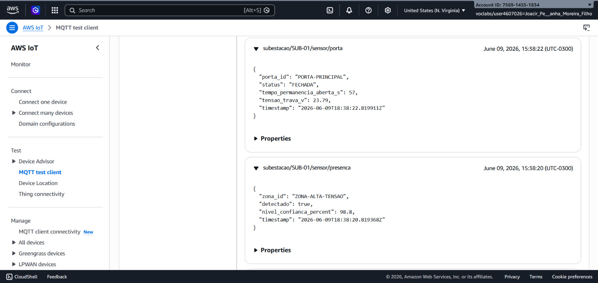
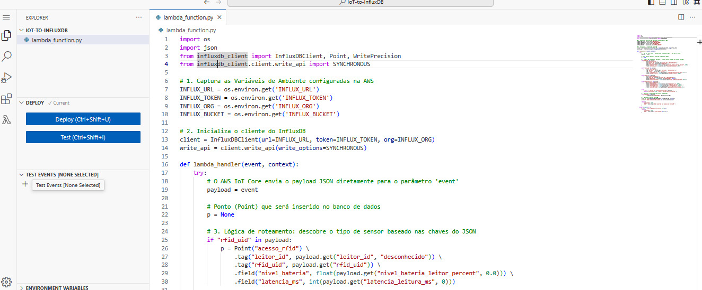
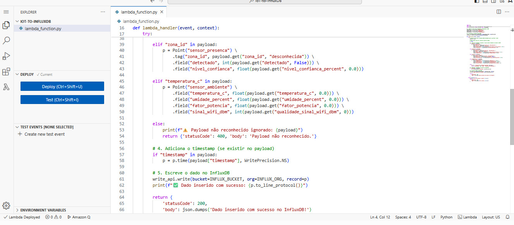
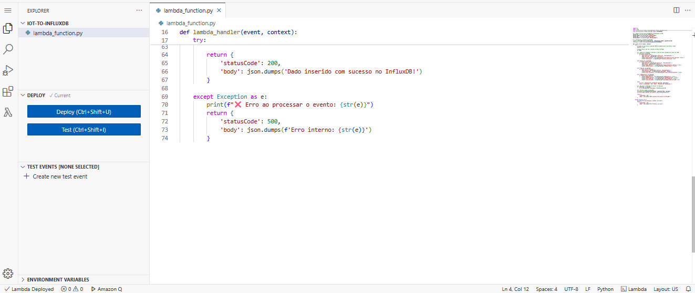
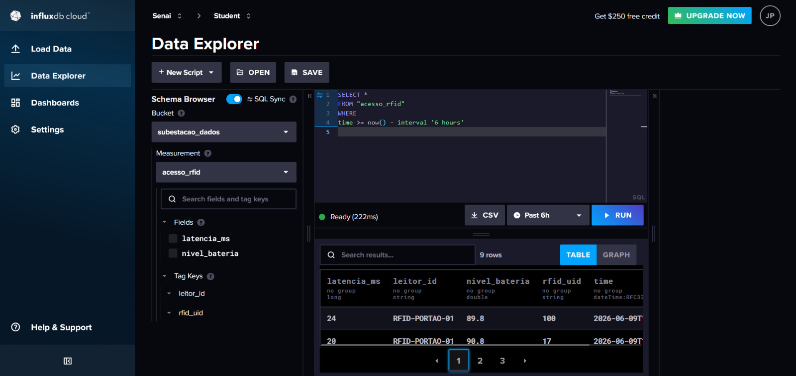
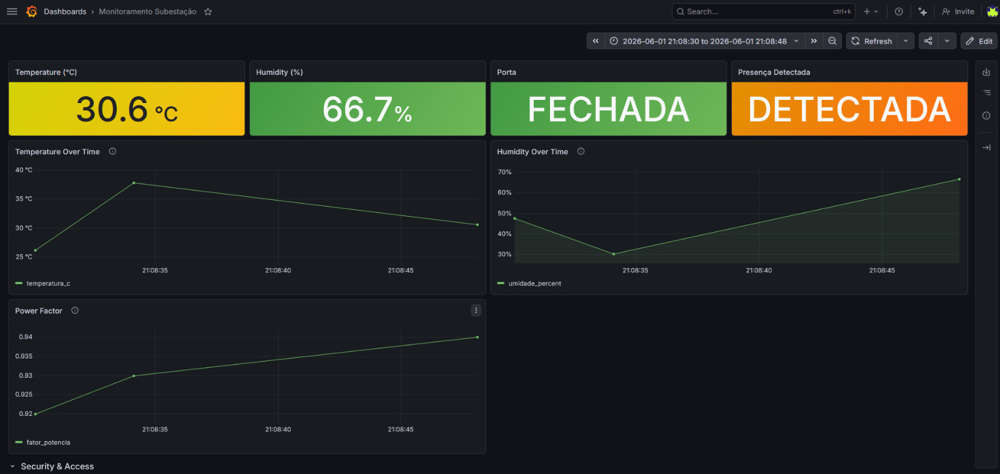
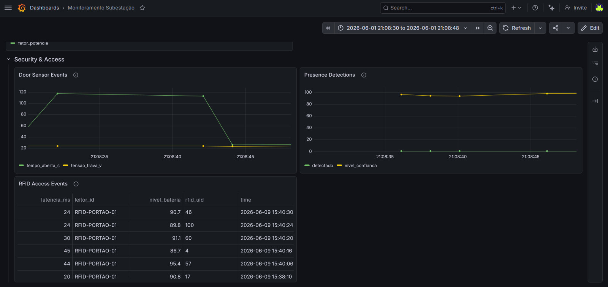

# Documentação de IoT - Projeto Integrador 3

Esta documentação descreve a arquitetura e os componentes da camada de Internet das Coisas (IoT) do projeto, incluindo a simulação dos dispositivos (ESP32), a comunicação via MQTT com a AWS IoT Core, a integração com funções Lambda e o armazenamento e visualização dos dados utilizando InfluxDB e Grafana.

## 1. Simulação do Gateway ESP32 (`esp32_integrador.ipynb`)

O arquivo Jupyter Notebook `esp32_integrador.ipynb` atua como um simulador para um Gateway ESP32, substituindo o hardware físico durante o desenvolvimento e testes. Ele utiliza a linguagem Python e a biblioteca `paho-mqtt` para estabelecer uma comunicação segura e criptografada (TLSv1.2) com o AWS IoT Core, enviando dados simulados de sensores de uma subestação.

### Funcionalidades e Sensores Simulados

O simulador conecta-se ao broker MQTT da AWS utilizando certificados e chaves privadas, e em um loop contínuo, gera e publica aleatoriamente eventos de quatro categorias diferentes de sensores:

- **Leitor RFID (Acesso):**
  - **Tópico MQTT:** `subestacao/SUB-01/acesso/request`
  - **Payload:** UID do cartão RFID lido, ID do leitor (`RFID-PORTAO-01`), nível de bateria do leitor (%) e latência de leitura (ms).

- **Sensor de Porta:**
  - **Tópico MQTT:** `subestacao/SUB-01/sensor/porta`
  - **Payload:** ID da porta (`PORTA-PRINCIPAL`), status atual (ABERTA ou FECHADA), tempo de permanência aberta em segundos e a tensão da trava elétrica (em torno de 24V).

- **Sensor de Presença:**
  - **Tópico MQTT:** `subestacao/SUB-01/sensor/presenca`
  - **Payload:** ID da zona (`ZONA-ALTA-TENSAO`), flag booleana de detecção e o nível de confiança do sensor (%).

- **Sensor de Ambiente:**
  - **Tópico MQTT:** `subestacao/SUB-01/sensor/ambiente`
  - **Payload:** Medições ideais para análise em séries temporais, incluindo temperatura (°C), umidade (%), fator de potência (0.92 a 0.99) e qualidade do sinal WiFi (dBm).

## 2. Recepção de Dados na AWS IoT Core

O Gateway virtualiza sua conexão direcionando-a para o endpoint específico da AWS IoT Core da conta. Dentro da AWS, o IoT Core gerencia a recepção e o roteamento de todas as mensagens publicadas nos tópicos MQTT do dispositivo. A imagem abaixo mostra o painel de testes do AWS IoT Core com a inscrição (subscribe) nos tópicos, recebendo as mensagens enviadas pela simulação.

## 3. Processamento com AWS Lambda

Para processar e rotear os dados recebidos pelo AWS IoT Core para outras ferramentas e bancos de dados, o projeto utiliza funções Serverless através do **AWS Lambda**. O IoT Core aciona as funções Lambda em resposta às mensagens que chegam em determinados tópicos.

As imagens abaixo mostram configurações e o código de processamento das funções Lambda integradas:

## 4. Armazenamento em Séries Temporais (InfluxDB)

Os dados gerados, especialmente as grandezas contínuas como as dos sensores de ambiente e monitoramento da porta, são consolidados e salvos no **InfluxDB**. O InfluxDB é um banco de dados altamente otimizado para dados de séries temporais (Time Series Database), permitindo o armazenamento eficiente e consultas complexas baseadas em tempo.

A imagem abaixo ilustra o Bucket criado no InfluxDB para organizar as informações (Measurements e Tags) enviadas através da integração.

## 5. Visualização e Dashboards (Grafana)

Para extrair inteligência, monitorar a subestação e criar alertas sobre as condições operacionais, o projeto conta com o **Grafana** conectado diretamente à fonte de dados do InfluxDB. 

No Grafana, foram construídos painéis (dashboards) interativos, ricos visualmente e atualizados em tempo real, que permitem observar com clareza todo o comportamento simulado do ESP32: desde leituras de qualidade de energia e temperatura até o controle de acessos da subestação.

